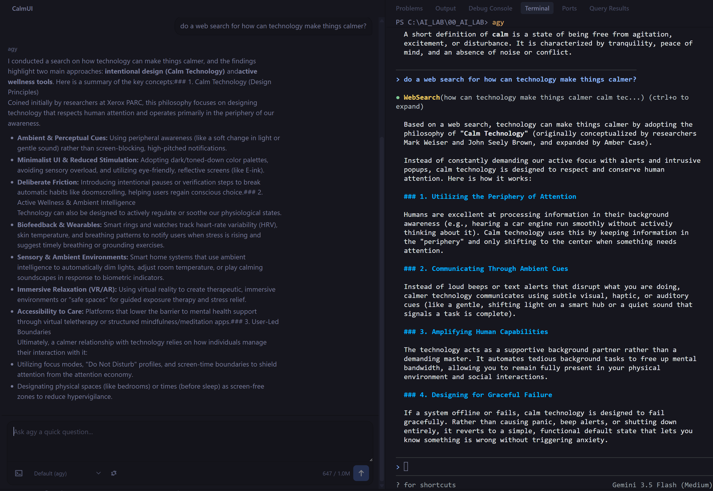
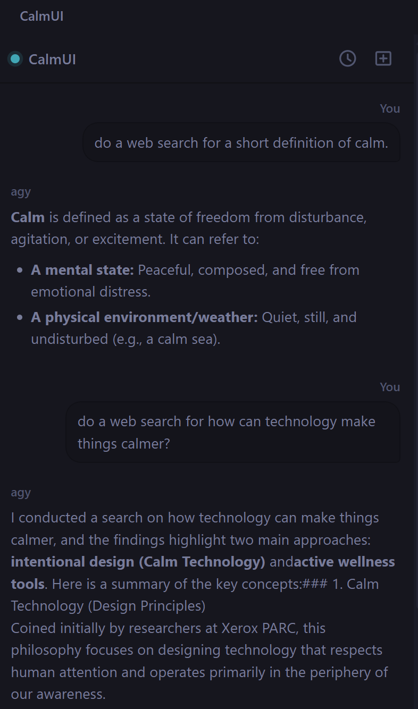
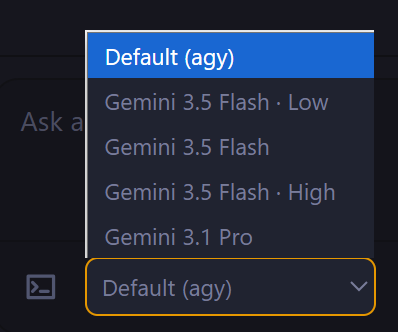
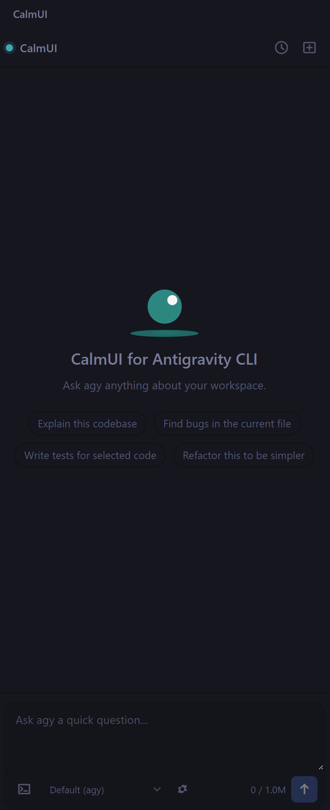

# CalmUI for Antigravity CLI

A calm, lightweight quick-ask side panel for the Antigravity CLI (`agy`) inside VS Code-compatible editors, including Antigravity IDE.



> **Unofficial.** This project is not affiliated with, endorsed by, or sponsored by Google. "Antigravity" is a Google product name; this extension is named descriptively under nominative fair use.

## What It Does

CalmUI gives `agy` a compact side-panel companion for quick questions while keeping the full terminal workflow close by. Ask in the panel when you want a fast answer. Jump to the terminal when the task needs edits, commands, approvals, or a longer agentic loop.

The panel is intentionally read-only. It does not edit files, run shell commands, or bypass permission prompts. Advanced work stays in the real Antigravity terminal where `agy` owns the normal approval flow.

## Screenshots

### Quick Ask Panel



### Model Switcher



### Empty State



## Features

- Activity-bar side panel for quick `agy` questions
- Streamed responses from `agy -p` through a real pseudo-terminal
- Conversation history saved per workspace
- New chat button for fresh context
- Model switcher populated from `agy models`, with a static fallback
- Estimated context meter for the active conversation
- Settings shortcut in the composer rail
- Markdown rendering for responses
- Stop button for canceling an in-flight response
- Diagnostics command for binary detection, resolved path, version, and auth probe
- Terminal handoff button that opens an interactive `agy` session prefilled with your prompt

## Why A Terminal Handoff?

`agy -p` is useful for quick answers, but the current CLI does not expose a bidirectional approval protocol for side panels. That means CalmUI cannot honestly show native edit-approval cards or safely drive multi-step file changes from the webview.

So CalmUI keeps a simple boundary:

- Use the panel for quick asks, codebase questions, and short research.
- Use the terminal for file edits, command execution, permission prompts, and long-running agent work.
- CalmUI never passes `--dangerously-skip-permissions`.

## Requirements

- Antigravity CLI (`agy`) installed and signed in
- VS Code 1.93+ or a compatible editor such as Antigravity IDE
- Windows, macOS, or Linux

## Install

Download the `.vsix` from GitHub Releases, then install it manually.

In VS Code:

```bash
code --install-extension calmui-for-antigravity-cli-0.3.0.vsix
```

In Antigravity IDE:

```bash
antigravity --install-extension calmui-for-antigravity-cli-0.3.0.vsix
```

Reload the editor window, then open CalmUI from the activity bar.

## Guided Setup

1. Install Antigravity CLI.

   Windows PowerShell:

   ```powershell
   irm https://antigravity.google/cli/install.ps1 | iex
   ```

   macOS / Linux:

   ```bash
   curl -fsSL https://antigravity.google/cli/install.sh | bash
   ```

2. Fully quit and reopen your editor so the updated `PATH` is visible.

3. Run `agy` once in a normal terminal and complete login, terms, theme, and workspace trust.

4. Install the CalmUI VSIX and reload the editor.

5. Open CalmUI from the activity bar and run `CalmUI: Run Diagnostics` if the panel does not answer.

For Google Cloud / Vertex setups, let `agy` own auth. CalmUI does not manage API keys, OAuth tokens, or ADC. If `agy` works in your terminal, CalmUI should inherit that path.

## Settings

| Setting | Default | Description |
| --- | --- | --- |
| `calmui-agy.agyPath` | `agy` | Path to the `agy` binary. Leave as `agy` to resolve from `PATH`. |
| `calmui-agy.model` | empty | Optional model override passed as `--model`. Also set by the model dropdown. |
| `calmui-agy.includeDirectories` | `[]` | Extra absolute paths passed as `--add-dir` on every prompt. |
| `calmui-agy.printTimeoutSeconds` | `120` | Timeout for one quick-ask prompt, passed as `--print-timeout`. |

## FAQ

### Can CalmUI edit my files?

No. CalmUI is intentionally read-only. Use it for quick asks, explanation, codebase orientation, and drafting. For edits, commands, approvals, and long agent sessions, use the terminal handoff button.

### Why not implement in-panel approvals?

The current `agy` CLI does not expose a bidirectional IDE protocol for approval cards or file diffs. CalmUI wraps `agy -p` through a pseudo-terminal, which is enough for quick answers but not enough for honest in-panel edit orchestration.

### Why does the terminal button only prefill a command?

That is deliberate. Starting an interactive agentic session can lead to file edits and command approvals, so CalmUI opens the terminal and leaves the final Enter key to you.

### Why does CalmUI need `node-pty`?

`agy -p` produces answer text through a TTY-style renderer. A plain stdout pipe can receive zero bytes. CalmUI runs `agy` inside a pseudo-terminal, captures the terminal stream, strips ANSI/control output, and renders the clean response.

### How does model discovery work?

CalmUI asks `agy models` when the panel loads. If the command returns model names, the dropdown uses that list. If discovery fails or returns nothing, CalmUI falls back to a small known-safe list.

You can test the underlying CLI command yourself:

```bash
agy models
agy models --help
```

### Where are useful logs?

Antigravity CLI logs are usually at:

```text
~/.gemini/antigravity-cli/cli.log
```

This is useful for troubleshooting auth, model availability, timeouts, and empty responses.

## Troubleshooting

### `agy` works in my terminal but not in CalmUI

Fully quit and reopen the editor. On Windows especially, a simple Reload Window may not refresh `PATH`.

If needed, set `calmui-agy.agyPath` to the full binary path. On Windows the default install is usually:

```text
%LOCALAPPDATA%\agy\bin\agy.exe
```

### The panel says auth failed

Run `agy` in a normal terminal and complete login. CalmUI does not perform its own authentication.

### The answer timed out

Increase `calmui-agy.printTimeoutSeconds`, ask a smaller question, or continue in the full Antigravity terminal.

### The model dropdown option returns an empty answer

The selected model may not be available for your account or environment. Switch back to `Default (agy)` and run Diagnostics.

## Roadmap

Near-term:

- FAQ and guided install/auth setup improvements
- Preflight caution card for edit/command prompts
- Better terminal handoff with model, context, and conversation continuity where possible
- File/current-selection context for quick asks
- File/image attach chips sent as explicit path references
- Dynamic model discovery from `agy models`, with static fallback
- Conversation rename/delete/export
- Context meter color thresholds and warnings
- Troubleshooting log viewer for `cli.log`

Later:

- `agy update` / `agy changelog` helper surfaced in Diagnostics
- Sandbox handoff mode
- Native in-panel approvals and diffs if Antigravity CLI ships a documented bidirectional protocol

## Development

```bash
npm install
npm run build
npm test
npm run package
```

Key docs:

- `ARCHITECTURE.md` - module map and transport contract
- `BUILD-PLAN.md` - phased rollout and acceptance criteria
- `TRANSPORT-PROVEN.md` - node-pty transport proof

## License

MIT
